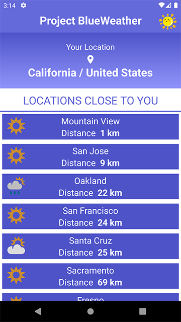
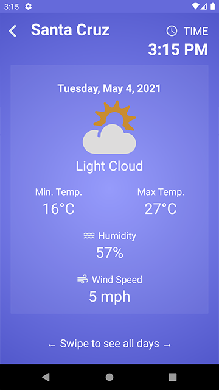

Project BLUEWEATHER
===================

### Description
Project BlueWeather is a weather forecast application for android. It lists the locations closest to you. 
It then provides the 7-day weather forecast for the selected location. 

### How to run
>* Download the .zip file (Code -> Download ZIP on GitHub)
>* Unzip it
>* Open Android Studio and then do the following
>* File -> Open -> Select the unzipped folder and it should be ready for use

### How to use
>* Start the app
>* Allow GPS Access
>* Choose a location from the locations list

### Screenshots

